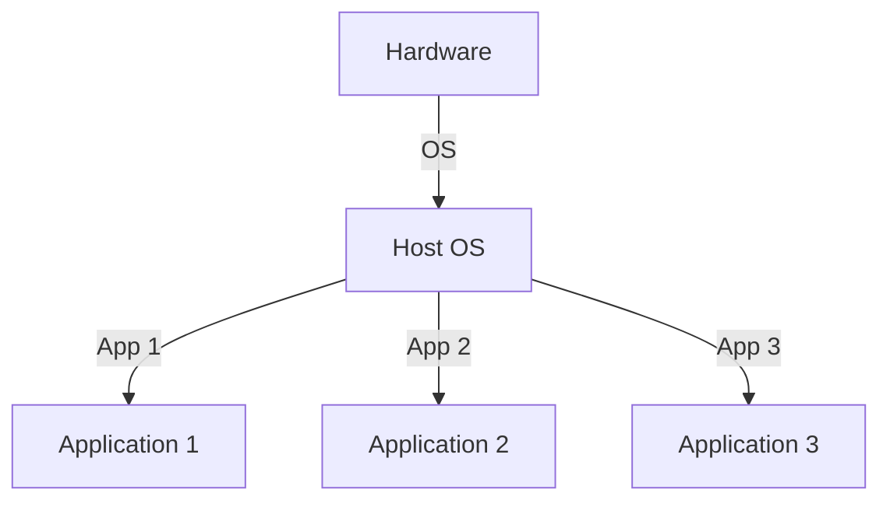
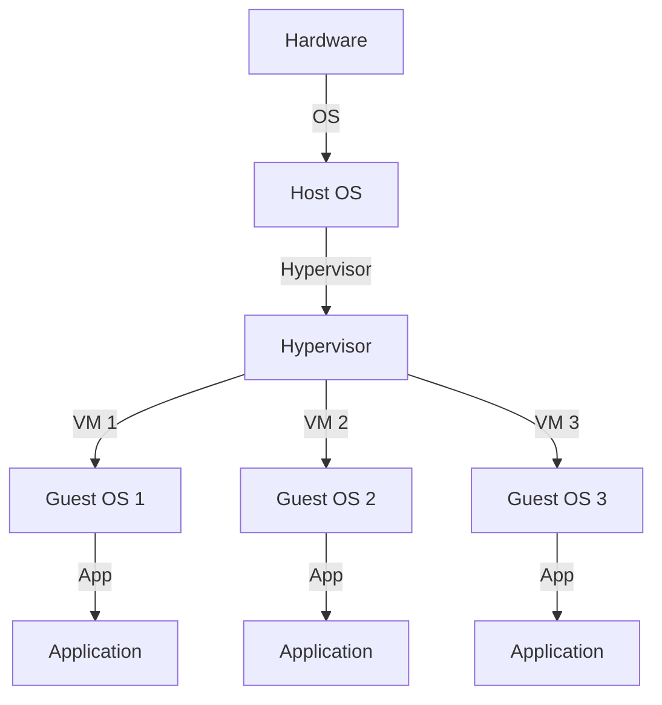
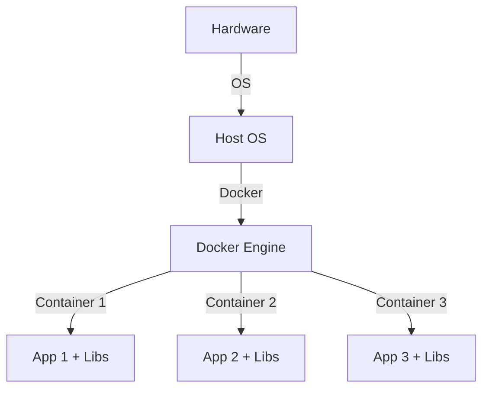

# Docker

[*Wikipedia*](https://en.wikipedia.org/wiki/Docker_(software))

Docker è una piattaforma per creare, distribuire e gestire applicazioni in **container**, che sono ambienti isolati e portabili. Ogni container include tutto ciò che serve per eseguire un'applicazione: codice, runtime, librerie e dipendenze.  

#### **Vantaggi di Docker:**  
- **Portabilità:** Funziona su qualsiasi sistema con Docker installato.  
- **Isolamento:** Ogni container ha le sue dipendenze, evitando conflitti.  
- **Efficienza:** Usa meno risorse rispetto alle VM, condividendo il kernel del sistema operativo.  

### **Docker Compose**  
Docker Compose è uno strumento per definire e gestire **applicazioni multi-container** con un singolo file `docker-compose.yml`.  

#### **Esempio di file `docker-compose.yml` per un'app con un database:**  
```yaml
version: "3.8"
services:
  app:
    image: myapp
    ports:
      - "8080:80"
    depends_on:
      - db

  db:
    image: mysql:latest
    environment:
      MYSQL_ROOT_PASSWORD: example
```

Il seguente schema spiega la differenza tra l'esecuzione di software su Bare Metal (Direttamente su un device con OS installato), su un sistema di VM (macchine virtuali) e su un Docker (container).

#### Bare Metal


#### VM


#### Docker


---
[Home](/indice.md) [Dizionario](/docs/dictionary/indice.md)