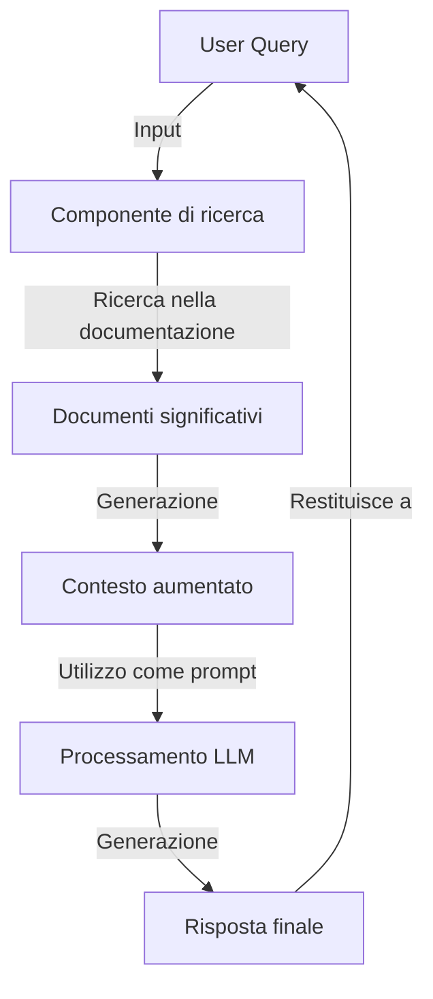

# Rag

[*Wikipedia*](https://en.wikipedia.org/wiki/Retrieval-augmented_generation)

RAG (Retrieval-augmented generation) è un approccio per la generazione di testi utilizzando un [LLM](/docs/dictionary/llm.md) che prevede l'accesso del LLM a della documentazione specifica per l'utente.

Per semplificare si potrebbe dire che RAG è un algoritmo secondario che riconosce il campo semantico della richiesta, trova al interno di un database di documenti quelli più significativi per il compito e li fornisce al [LLM](/docs/dictionary/llm.md) che utilizza il contenuto per generare una risposta.

---
[Home](/indice.md) [Dizionario](/docs/dictionary/indice.md)