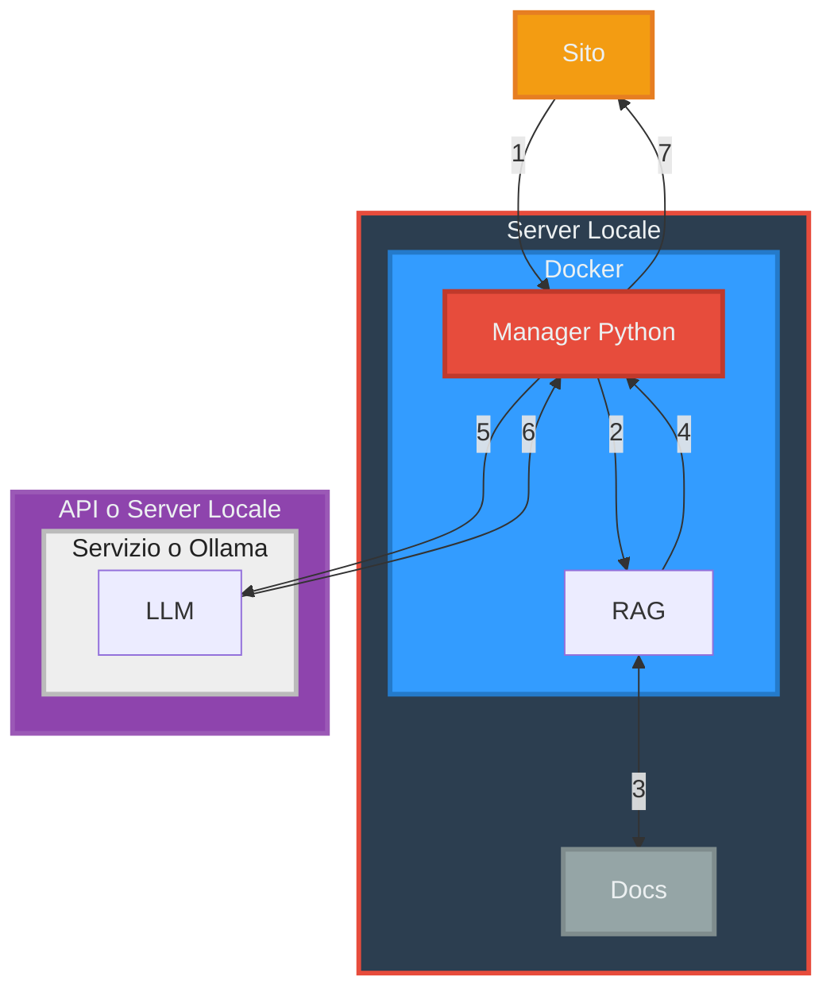

# Tech Stack del progetto

Per la definizione di Tech Stack, vedi [Tech-Stack](/docs/dictionary/techstack.md).

Il tech stack ideato per questo progetto è il seguente

1. L'utente utilizza il sito per porre una domanda che viene passata al Manager Python.
2. Il Manager interroga la [RAG](/docs/dictionary/rag.md).
3. La [RAG](/docs/dictionary/rag.md) ricerca nella documentazione il contenuto relativo alla domanda.
4. La [RAG](/docs/dictionary/rag.md) restituisce al Manager la documentazione rilevante.
5. Il manager passa la domanda originale e la documentazione rilevante al [LLM](/docs/dictionary/llm.md).
6. La [LLM](/docs/dictionary/llm.md) genera la risposta e la restituisce al Manager.
7. Il Manager restituisce la risposta all'utente.

L'[LLM](/docs/dictionary/llm.md) in questione potrebbe essere ospitata su un server locale o utilizzata tramite [API](/docs/dictionary/api.md).
Per ulteriori informazioni, vedi [Valutazione LLM](/docs/llmval.md)

---
[Home](/indice.md) [Dizionario](/docs/dictionary/indice.md)